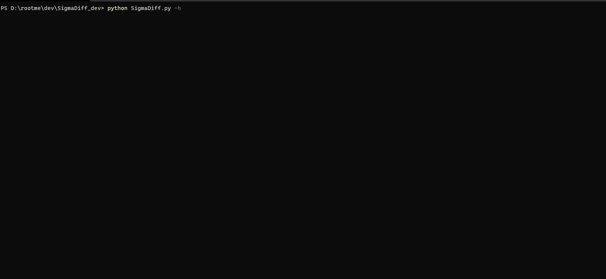
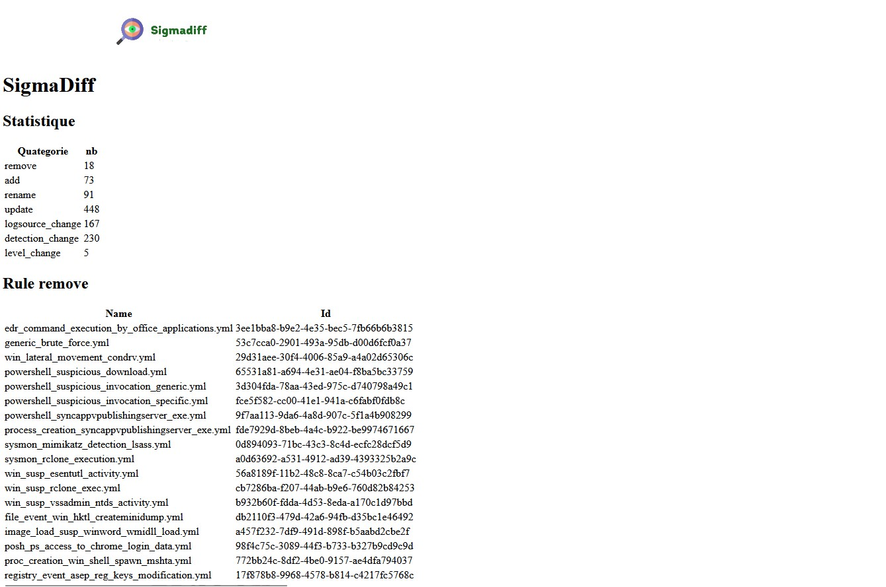
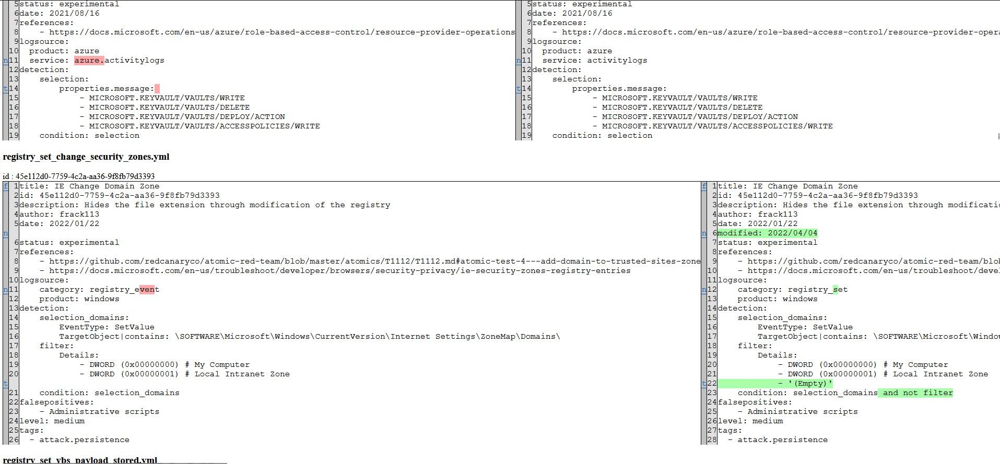

# SigmaDiff
know the rules that have changed between 2 Sigma rules folder

## the purpose
When you have a offline folder of SigmaHQ rules you can not use git to know the important changes
This script helps you to know the detection changes.
For example a change of title or reference is not taken into account.

For me it's more a python training than a tool for a production system

## Use

I tried to keep it as simple as possible :\
Sigmadiff -o {folder of current sigma rules} -n {folder of last simga rules}

## Html output
Version 0.6.5 very basic but works

## Csv output

* file
  * delete
  * rename (you have the old and the new name :relaxed: )
  * new
  * change
* rule change
  * title
  * status
  * date (should not be change)
  * modified
  * author
  * description
  * references
  * logsources
  * detection
  * falsepositives
  * level
  * tags

You can focus first where `logsources` or `detection` change `Y`
