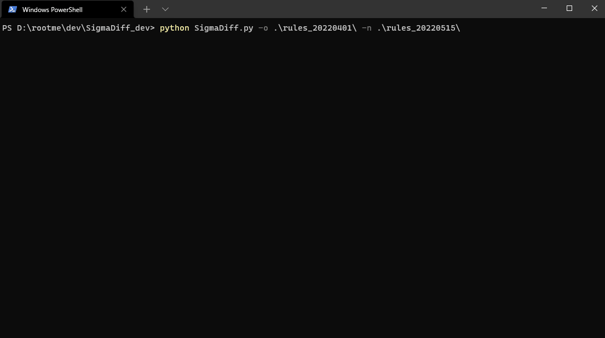

# SigmaDiff
know the rules that have changed between 2 Sigma rules folder

## the purpose

## Use

I tried to keep it as simple as possible :
Sigmadiff 

## Html output

## Csv output

* file
  * delete
  * rename (you have the old and the new name :relaxed: )
  * new
  * change
* rule change
  * title
  * status
  * date (should not be change)
  * modified
  * author
  * description
  * references
  * logsources
  * detection
  * falsepositives
  * level
  * tags

You can focus first where `logsources` or `detection` change `Y`
